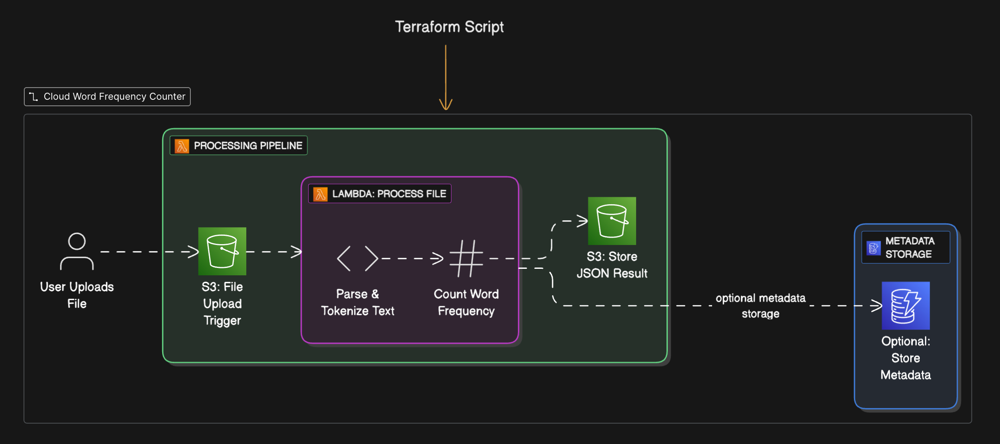

## Word Frequency Application

A cloud-based application that analyzes word frequencies in text files using AWS serverless architecture and React frontend.

### Architecture Diagram



## Architecture Overview

The application consists of:

- **Frontend**: React + TypeScript application built with Vite
- **Backend**: AWS Serverless architecture including:
  - Lambda Functions
  - API Gateway
  - S3 Bucket for file storage
  - DynamoDB for data persistence

## Prerequisites

- Node.js (v18 or higher)
- AWS CLI configured with appropriate credentials
- Terraform installed
- `.env` file with AWS credentials

## Project Structure

```
word-frequency-app/
├── frontend/           # React frontend application
├── lambdas/           # AWS Lambda functions
│   ├── upload-handler/    # Handles file uploads to S3
│   ├── process-handler/   # Processes uploaded files
│   └── frequency-handler/ # Calculates word frequencies
├── terraform/         # Infrastructure as Code
└── scripts/          # Deployment scripts
```

## Setup and Deployment

1. **Configure AWS Credentials**
   Create a `.env` file in the root directory with your AWS credentials:

   ```
   AWS_ACCESS_KEY_ID=your_access_key
   AWS_SECRET_ACCESS_KEY=your_secret_key
   AWS_REGION=your_preferred_region
   ```

2. **Deploy the Application**

   ```bash
   # Make the scripts executable
   chmod +x apply.sh
   chmod +x destroy.sh

   # Deploy the application
   ./apply.sh
   ```

   This script will:

   - Package Lambda functions
   - Deploy AWS infrastructure using Terraform
   - Build and start the frontend application

3. **Access the Application**
   Once deployed, the frontend will be available at `http://localhost:3000`

## Development

### Frontend Development

```bash
cd frontend
npm install
npm run dev
```

### Lambda Functions

Each Lambda function has its own `package.json` and dependencies. To modify a Lambda:

```bash
cd lambdas/<function-name>
npm install
# Make your changes
# Redeploy using apply.sh
```

### Infrastructure Changes

Infrastructure is managed with Terraform. To modify:

```bash
cd terraform
# Make changes to .tf files
terraform plan    # Review changes
terraform apply   # Apply changes
```

## Cleanup

To destroy all created AWS resources:

```bash
./destroy.sh
```

## Architecture Details

1. **Frontend**

   - Built with React + TypeScript
   - Uses Vite for fast development and building
   - Modern UI with responsive design

2. **Backend Services**

   - Upload Handler: Manages file uploads to S3
   - Process Handler: Processes uploaded files
   - Frequency Handler: Calculates and returns word frequencies

3. **AWS Resources**
   - API Gateway for RESTful endpoints
   - S3 for file storage
   - DynamoDB for storing analysis results
   - IAM roles and policies for security

## Scalability & Security

### Scalability

This application is designed to scale efficiently both at the infrastructure and application levels:

- **Serverless Architecture:** All backend logic is implemented as AWS Lambda functions, which automatically scale up or down based on incoming request volume. There are no servers to manage, and you only pay for what you use.
- **API Gateway:** AWS API Gateway handles all HTTP(S) requests, providing built-in support for high concurrency and throttling. It can handle thousands of simultaneous connections without manual intervention.
- **S3 Storage:** File uploads are stored in Amazon S3, which is designed for virtually unlimited storage and high throughput. S3 automatically scales to handle large numbers of files and requests.
- **DynamoDB:** Analysis results are stored in DynamoDB, a fully managed NoSQL database that provides single-digit millisecond performance at any scale. DynamoDB automatically partitions and replicates data to meet demand.
- **Stateless Services:** Each Lambda function is stateless, allowing AWS to run multiple instances in parallel as needed. This enables the backend to handle spikes in traffic without bottlenecks.
- **Decoupled Components:** The frontend, backend Lambdas, and storage/database layers are loosely coupled, allowing each to scale independently.

### Security

Security is a core consideration throughout the stack:

- **IAM Roles & Policies:** Each Lambda function is assigned a least-privilege IAM role, granting only the permissions necessary for its operation (e.g., access to specific S3 buckets or DynamoDB tables).
- **Environment Variables:** Sensitive configuration (such as API keys and secrets) are managed via environment variables and never hardcoded in source code.
- **API Gateway Security:** API Gateway can be configured with throttling, request validation, and (optionally) authentication mechanisms such as API keys, Cognito, or custom authorizers.
- **S3 Bucket Policies:** S3 buckets are private by default, with access restricted to only the necessary Lambda functions. Public access is disabled unless explicitly required.
- **Data Encryption:** Data at rest in S3 and DynamoDB is encrypted using AWS-managed keys. Data in transit is protected via HTTPS endpoints.
- **Input Validation:** Lambda functions validate and sanitize all incoming data to prevent injection attacks and malformed requests.
- **Dependency Management:** All dependencies are managed via `npm` and kept up to date to minimize vulnerabilities.
- **Infrastructure as Code:** Terraform is used to provision and manage all AWS resources, ensuring consistent, auditable, and repeatable deployments.

By leveraging AWS managed services and following best practices for security and scalability, this application is robust, cost-effective, and ready to handle production workloads.
